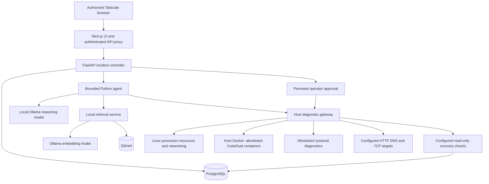

# Local AI Home-Lab Operator architecture

The application investigates infrastructure incidents with a local model that chooses constrained diagnostics. PostgreSQL persists observations, hypotheses, proposed actions, and evidence-backed reports. A separate host gateway executes the approved diagnostic vocabulary. The model has no shell tool.

This document describes the implementation and configured deployment. Live validation and measured model results belong in `IMPLEMENTATION.md`, `DEPLOYMENT.md`, and `MODEL_EVALUATION.md`; a diagram or configured health check is not proof that a service is running.

## Components and data flow

The frontend displays incident history, investigation progress, observations, hypotheses, topology, diagnoses, and approval controls. Its server-side proxy holds the backend bearer token. The browser receives an expiring signed session cookie after operator authentication. The UI polls incident state; it does not run host commands.

FastAPI uses a custom Python orchestrator. `LLMProvider` defines decision/report interfaces, and `OllamaLLMProvider` supplies local inference with schema-constrained JSON and one bounded repair retry. Environment configuration selects the model and context/runtime budgets. A single concurrent investigation is the default to suit the consumer CPU/RAM budget.

## Investigation lifecycle

An incident begins `OPEN`. Starting an investigation claims it and sets `INVESTIGATING`. The agent retrieves optional local context, asks the model for the next structured decision, validates the tool/arguments, calls the gateway, and records the result before asking for another decision. Each decision can update explicit hypotheses and supporting or contradicting observation links. Tool selection depends on the accumulated evidence; production orchestration does not follow the scripted evaluation plans.

The loop limits decisions, total runtime, model time, tool time, context size, and identical tool/argument repeats. Unknown tools and state changes presented as automatic diagnostic calls are rejected. Rejected decisions generate bounded feedback; repeated policy failures stop the investigation. A transport/permission failure is stored as a failed diagnostic and does not establish target failure by itself.

A diagnosis must cite existing observations from the same incident and include at least one successful diagnostic. Confidence is capped according to the number of distinct successful tools, with a maximum of 95%. It remains a model estimate, not an empirically calibrated probability. Citation validation checks ownership and successful execution; it does not prove every causal interpretation is correct.

A diagnosed incident remains open until recovery is verified. Enabled, valid remediation proposals create `WAITING_FOR_APPROVAL` actions. The operator approves an exact action before dispatch. Recovery runs administrator-configured checks from the affected service and its dependencies; every check must match before status becomes `RESOLVED`. Unsupported verification remains blocked/open. Interrupted investigations are marked failed on backend startup, and uncertain writes are never replayed automatically.

## Persistence and local retrieval

PostgreSQL tables are `incidents`, `observations`, `hypotheses`, `actions`, `audit_events`, and `evaluation_runs`; Alembic manages schema changes. Incident state and results survive browser refreshes and application restarts. Important events record incident ID, model/tool timing, structured decisions, evidence, approvals, and verification results after redaction.

Runbooks in `runbooks/*.md` are split into bounded sections, embedded by a configurable local Ollama embedding model, and stored in Qdrant. Verified resolved incidents can be indexed with symptoms, root cause, important observations, and verification evidence. Retrieval uses a configured top-K and similarity threshold. The collection name includes an embedding-model identifier to separate incompatible spaces. Retrieval failures are recorded and the diagnostic loop can continue without RAG. Retrieved material supplies investigation guidance and never substitutes for current observations.

## Actual CodeDuel topology

`config/topology.json` is grounded in the inspected production Compose at `/opt/codeduel/docker-compose.prod.yml`. Existing remote-managed `cloudflared` sends public traffic to `127.0.0.1:8085`, the NGINX `codeduel-proxy-1` container. `codeduel-frontend-1` serves the frontend. `codeduel-api-1` uses internal port 5000 and `/health/ready`; `codeduel-worker-1` consumes BullMQ work. `codeduel-redis-1` provides password-protected Redis on the private backend network.

MongoDB is external Atlas, not a local container. The worker also uses a separate rootless judge Docker socket at `/run/user/1001/docker.sock`. Current gateway Docker tools inspect the host daemon and selected application containers, not that separate judge daemon. Container HTTP aliases resolve the inspected container address without publishing new application ports.

At discovery, public frontend/proxy/Redis worked while API and worker were already restarting with Atlas server-selection errors. That baseline is preserved in `SERVER_INVENTORY.md`. A homepage HTTP 200 does not establish API or submission health, and the logs' generic IP-allowlist suggestion does not establish the precise Atlas cause.

## Configured deployment boundaries

| Component | Host binding | Execution/storage |
| --- | --- | --- |
| Next.js web | `100.98.193.60:3080` | Container using host networking; non-root application |
| FastAPI | `127.0.0.1:18000` | Container using host networking; non-root application |
| Diagnostic gateway | `127.0.0.1:18081` | Dedicated `aiops-gateway` systemd account; root-owned installation under `/opt/aiops-gateway` |
| Ollama | `127.0.0.1:11434` | Local container and persistent model storage |
| PostgreSQL | `127.0.0.1:15432` | Local container and persistent database volume |
| Qdrant | `127.0.0.1:16333` | Local container and persistent vector storage |

The backend has neither a Docker socket mount nor root privileges. The gateway's Docker group membership is effectively host-root authority and makes it part of the trusted computing base; tool allowlists restrict callers, not the powers of a compromised gateway process. Internal services have no public hostname. Existing CodeDuel, Cloudflare, Tailscale, SSH, networks, and data volumes remain separate from the AI project.

## Evaluation and current limits

`python -m evals.run` injects a deterministic provider and mock gateway into the production `Agent` for eight synthetic incidents. This is labeled an orchestration/safety regression. `--provider ollama` measures actual local-model decisions against the same fixture ground truth. JSON reports persist scenarios, decisions, observations, rubric, timing, and aggregate scores; optional database persistence adds `EvaluationRun` records. Tests never intentionally crash production services or change host networking.

Current policy allows approval-controlled start/restart operations only for the isolated `aiops-demo` container. All 22 preexisting containers remain read-only and systemd writes are disabled. Production target enablement is gated on actual local-model diagnosis validation on at least three scenarios plus explicit target/verification review. Health verification has the scope of the configured checks: it does not perform an actual test submission, inspect queue counts, independently authenticate to Atlas, verify a Tailscale connection from another peer, or inspect live rfkill state. Report these limits when they affect a diagnosis or recovery claim. A small model may select poor diagnostics despite valid JSON, so real model benchmarks and operator review remain necessary.
