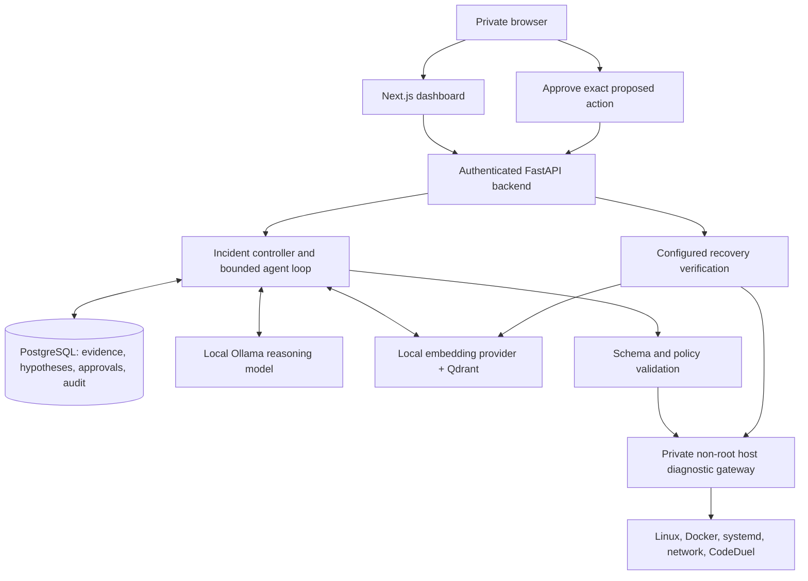

# AI Home-Lab Operator

A private, locally hosted infrastructure investigator for the Ubuntu home server. A small Ollama model chooses constrained diagnostic tools, maintains explicit hypotheses and cites current observations. PostgreSQL persists investigations; local embeddings and Qdrant retrieve runbooks and verified incident history. Changes require authenticated approval and deterministic recovery checks.

The server deployment is at **http://100.98.193.60:3080** over Tailscale. Use the generated operator password in the server `.env`. The approved private local handoff file `.local-access.txt` is excluded from Git. Final benchmark and acceptance results are recorded in IMPLEMENTATION.md, EVALUATION.md and MODEL_EVALUATION.md.

## How it works



The diagnostic sequence is chosen by the local model from prior results, not a fixed checklist. The backend enforces tool scope, schemas, steps, timeouts, duplicate detection, evidence ownership, approval state and verification. The model never receives a general command executor or Docker socket.

## Use

1. Sign in and describe a symptom, such as `codeduel.online is down`.
2. Follow the live timeline and current/eliminated hypotheses. Expand an observation to inspect arguments and redacted results.
3. Read the evidence-backed report and recommendations. Model confidence is an estimate, not a calibrated probability.
4. Review each proposed change. Approving one action does not approve other actions or future retries.
5. Recovery checks verify the affected service and its configured dependencies. Only verified recovery sets RESOLVED and indexes history.

A healthy service can yield an evidence-backed finding that no outage is currently reproduced. Historical errors are not proof of a current incident. NEED_USER_INPUT and time/policy failures remain visible rather than being converted into a fabricated diagnosis.

## Demonstration

Synthetic fixture example, not a claim about a current outage:

```text
User: CodeDuel submissions are stuck.
Agent: Select worker/dependency checks based on each observed result.
       API is healthy; worker logs identify failed Redis connections.
       Redis container is unavailable.
Diagnosis: Redis outage is preventing BullMQ job processing.
Evidence: Current worker logs and Redis state observations.
Recommendation: Start/restart the evidenced Redis target after approval.
Operator: Approves the exact proposed action.
Agent: Dispatches once, verifies dependency and application health,
       records recovery evidence, marks resolved, saves local history.
```

The live acceptance test uses a separate `aiops-demo` container to exercise approval, rejected unsigned writes, replay prevention, recovery and local history indexing. It never stops production CodeDuel to create a test failure. The live policy currently permits approved start/restart operations only on `aiops-demo`; all 22 preexisting containers are available for read-only diagnostics. Production writes remain disabled pending genuine local-model diagnosis validation on at least three scenarios and a separate target/verification review. SSH/Docker/Tailscale/systemd restarts remain disabled. The sandbox approval test does not establish model accuracy; see the benchmark reports for measured results.

## Repository

| Path | Purpose |
|---|---|
| `frontend/` | Next.js/TypeScript dashboard, server-side session and backend proxy |
| `backend/app/` | FastAPI, models, agent, provider interfaces, RAG, approvals and verifier |
| `backend/migrations/` | Alembic database migrations |
| `diagnostic_gateway/` | Typed tool allowlists, execution limits, redaction and approval ledger |
| `config/` | Discovered topology and administrator-owned targets |
| `runbooks/` | Eleven server-specific troubleshooting runbooks |
| `evals/` | Eight synthetic failures, production-loop runner and metrics |
| `scripts/` | Deployment checks, model benchmark, backup and demo acceptance |
| `deploy/` | Root-owned host gateway systemd configuration |

## Development and operations

Use Python3.12 for backend development and Node22 for the frontend. See DEPLOYMENT.md for installation, separate service environments, startup, logs, backup and private network controls. Backend and frontend run as non-root containers; the gateway is a dedicated systemd account with limited API operations but powerful Docker-group access, explicitly documented in SECURITY.md.

```bash
# Frontend
cd frontend
pnpm install --frozen-lockfile
pnpm build
# Backend regression and real model benchmark (from repository root)
python -m evals.run
python -m evals.run --provider ollama --model qwen2.5:3b
# Operate only this project's Compose namespace on the server
docker compose ps
docker compose logs --tail 100 backend
```

Runbooks/history never substitute for current observations. External MongoDB Atlas is an existing CodeDuel dependency; the operator's own reasoning, embeddings, logs, history and databases run locally. No cloud model or cloud embedding API is required.

Read SERVER_INVENTORY.md for discovered services and the preexisting transient CodeDuel Atlas failure, ARCHITECTURE.md for design decisions, SECURITY.md for boundaries and limitations, and IMPLEMENTATION.md for verified progress and remaining work.
