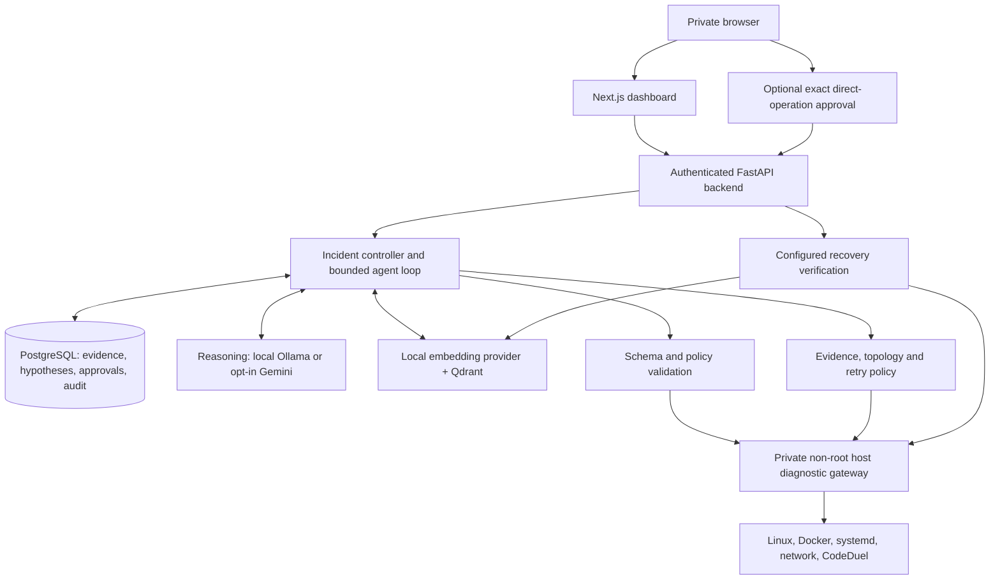

# AI Home Server Operations Agent

A private bounded operations agent for the Ubuntu home server. The reasoning provider is configurable: local Ollama remains the default, while Google Gemini is an explicit cloud opt-in. The model chooses named capabilities, maintains explicit hypotheses and cites current observations; deterministic code executes each capability. PostgreSQL persists investigations; local Ollama embeddings and Qdrant retrieve runbooks and verified incident history. Configured safe recovery can run without per-action approval, but every write has policy validation, one-use signing, an audit record and deterministic verification. Direct operator-requested operations retain exact-action approval.

The server deployment is at **http://100.98.193.60:3080** over Tailscale. Use the generated operator password in the server `.env`. The approved private local handoff file `.local-access.txt` is excluded from Git. Final benchmark and acceptance results are recorded in IMPLEMENTATION.md, EVALUATION.md and MODEL_EVALUATION.md.

## Remote access and daily operation

On another computer signed into the same authorized tailnet, open `http://100.98.193.60:3080`. Log in with the `AIOPS_ADMIN_PASSWORD` from the server's private `.env` or the separately approved local handoff file. Open **Server overview** for host resources, container states, network health and configured application checks. Use **Investigate** to ask a question. For an approved direct operation, check the application, propose its exact Start or Restart action, review the current state, then approve it. The action and verification appear in incident history. Authenticated login, overview, history, topology and logout were verified from a separate Mac over Tailscale on 18 September 2026.

From the server project directory, `docker compose -f docker-compose.yml -f docker-compose.prod.yml up -d` starts HomeServerAI, `docker compose stop` stops its containers without removing volumes, `docker compose ps` shows status, and `docker compose restart backend frontend` restarts the application. The host gateway is managed separately with `sudo systemctl status aiops-gateway`, `sudo systemctl start aiops-gateway`, `sudo systemctl stop aiops-gateway`, or `sudo systemctl restart aiops-gateway`. See DEPLOYMENT.md for the guarded update path and logs.

Autonomous recovery is disabled by default (`ENABLE_AUTONOMOUS_ACTIONS=false`) pending a passing real-model evaluation and live acceptance. After a full real-model and live acceptance pass, enabling recovery requires both an administrator-reviewed exact container-only `autonomous_actions` subset and `ENABLE_AUTONOMOUS_ACTIONS=true`, followed by canonical deployment. Never grant host control-plane targets. An administrator can disable it again by setting that value in the private server `.env` and recreating the backend through the guarded deployment process; gateway target policy remains authoritative. If the page does not load, check Tailscale membership and `docker compose ps`; if login fails, check the private password and frontend logs; if diagnostics fail, check backend and gateway status. Do not repeatedly approve an uncertain action: inspect its recorded result and current target state first.

## How it works


```mermaid
flowchart TD
  Browser[Private browser] --> Frontend[Next.js dashboard]
  Frontend --> API[Authenticated FastAPI backend]
  API --> Controller[Incident controller and bounded agent loop]
  Controller <--> DB[(PostgreSQL: evidence, hypotheses, approvals, audit)]
  Controller <--> LLM[Reasoning: local Ollama or opt-in Gemini]
  Controller <--> RAG[Local embedding provider + Qdrant]
  Controller --> Tools[Schema and policy validation]
  Tools --> Gateway[Private non-root host diagnostic gateway]
  Gateway --> Host[Linux, Docker, systemd, network, CodeDuel]
  Controller --> Policy[Evidence, topology and retry policy]
  Policy --> Gateway
  Browser --> Approval[Optional exact direct-operation approval]
  Approval --> API
  API --> Verify[Configured recovery verification]
  Verify --> Gateway
  Verify --> RAG
```

The diagnostic sequence is chosen by the configured reasoning model from prior results, not a fixed checklist. The backend enforces tool scope, schemas, steps, timeouts, duplicate detection, evidence ownership, approval state and verification. The model never receives a general command executor or Docker socket.

The source now provides read-only exact HTTP/HTTPS, DNS, ping and configured TCP checks; Docker and systemd state, logs and resource use; CPU, memory, swap, disk, inode, uptime and load measurements; mounts and optional temperatures; structured listening ports, network interfaces and routes; bounded process inspection; and Tailscale status. Administrator-owned configuration determines every network, container, service and filesystem target that accepts arguments. `process_list` can order by memory or a short CPU sample; no process command line or environment is returned. Some host counters and listener PIDs depend on gateway-account visibility.

`check_application_health` runs the configured read-only checks for one service profile and its dependencies, reporting each component as `HEALTHY`, `UNHEALTHY`, or `UNKNOWN`. It is available to the agent and at `GET /api/applications/{application}/health`; it is a snapshot, not a complete user-journey test. The server overview exposes this breakdown, recent autonomous operations and direct operation proposals. `POST /api/operations/propose` remains an operator-approved path; autonomous investigations use a separate evidence-gated action path. A deliberate stop is never autonomous recovery, verifies only that exact target stopped, and never marks an incident resolved.

The deployed gateway allows operator-approved start/restart for the five exact CodeDuel containers and start/stop/restart for aiops-demo. Host service writes, including Cloudflare, are disabled. Autonomous dispatch is implemented but disabled in the backend and has no gateway grants because real-model acceptance has not passed. There is no arbitrary shell, bulk restart, process kill, reboot, delete, firewall edit or package-upgrade capability.

## Use

1. Sign in and describe a symptom, such as `codeduel.online is down`.
2. Follow the live timeline and current/eliminated hypotheses. Expand an observation to inspect arguments and redacted results.
3. Read the evidence-backed report and recommendations. Model confidence is an estimate, not a calibrated probability.
4. For an allowlisted unhealthy target, the agent can execute one policy-authorized action without waiting for approval; direct operation proposals still require approval.
5. Exact-target checks follow each autonomous write. Final recovery checks verify the application and dependencies; only verified recovery sets RESOLVED and indexes history.

A healthy service can yield an evidence-backed finding that no outage is currently reproduced. Historical errors are not proof of a current incident. NEED_USER_INPUT and time/policy failures remain visible rather than being converted into a fabricated diagnosis.

## Demonstration

Synthetic fixture example, not a claim about a current outage:

```text
User: CodeDuel submissions are stuck.
Agent: Select worker/dependency checks based on each observed result.
       API is healthy; worker logs identify failed Redis connections.
       Redis container is unavailable.
Diagnosis: Redis outage is preventing BullMQ job processing.
Evidence: Current worker logs and Redis state observations.
Recommendation: Start the evidenced, stopped Redis target under policy.
Agent: Dispatches once without routine approval, verifies Redis and application health,
       records recovery evidence, marks resolved, saves local history.
```

Live acceptance on 18 September 2026 performed one approved CodeDuel frontend restart. Its audit persisted, replay was rejected, and follow-up verification resolved the incident without another restart. This proves the manual operation path; it does not establish autonomous recovery quality. The real-model gate remains unmet. See MODEL_EVALUATION.md and IMPLEMENTATION.md for measured results.

### Verification status of this expansion

- **Deployed:** Dashboard, diagnostics, exact approved CodeDuel actions, signed one-use dispatch, verification, audit and history.
- **Validated:** 179 Python tests, 10 frontend tests, TypeScript and production build; authenticated access from the Mac; one approved production frontend restart.
- **Disabled:** Autonomous recovery and all host service writes.
- **Limitations:** Gemini investigation/evaluation reliability, imperfect runbook retrieval, and pre-existing CodeDuel API failure remain documented acceptance gaps.

## Repository

| Path | Purpose |
|---|---|
| `frontend/` | Next.js/TypeScript dashboard, server-side session and backend proxy |
| `backend/app/` | FastAPI, models, agent, provider interfaces, RAG, approvals and verifier |
| `backend/migrations/` | Alembic database migrations |
| `diagnostic_gateway/` | Typed tool allowlists, execution limits, redaction and approval ledger |
| `config/` | Discovered topology and administrator-owned targets |
| `runbooks/` | Fourteen server-specific troubleshooting runbooks |
| `evals/` | Eight synthetic failures, production-loop runner and metrics |
| `scripts/` | Deployment checks, model benchmark, backup and demo acceptance |
| `deploy/` | Root-owned host gateway systemd configuration |

## Development and operations

Use Python3.12 for backend development and Node22 for the frontend. See DEPLOYMENT.md for installation, separate service environments, startup, logs, backup and private network controls. Backend and frontend run as non-root containers; the gateway is a dedicated systemd account with limited API operations but powerful Docker-group access, explicitly documented in SECURITY.md.

```bash
# Frontend
cd frontend
pnpm install --frozen-lockfile
pnpm build
# Backend regression and real model benchmark (from repository root)
python -m evals.run
python -m evals.run --provider ollama --model qwen2.5:3b
# With GEMINI_API_KEY supplied only through the environment:
python -m evals.run --provider gemini --model gemini-3.8-flash
# Operate only this project's Compose namespace on the server
docker compose ps
docker compose logs --tail 100 backend
```

Runbooks/history never substitute for current observations. External MongoDB Atlas is an existing CodeDuel dependency. Ollama mode keeps reasoning, embeddings, logs, history and databases local and requires no cloud model or cloud embedding API. When Gemini is selected, bounded redacted incident context, tool results, topology and retrieved guidance are sent to Google's Gemini API for reasoning; embeddings and persisted application data remain local. See SECURITY.md before enabling the cloud provider.

Read SERVER_INVENTORY.md for discovered services and the preexisting transient CodeDuel Atlas failure, ARCHITECTURE.md for design decisions, SECURITY.md for boundaries and limitations, and IMPLEMENTATION.md for verified progress and remaining work.
